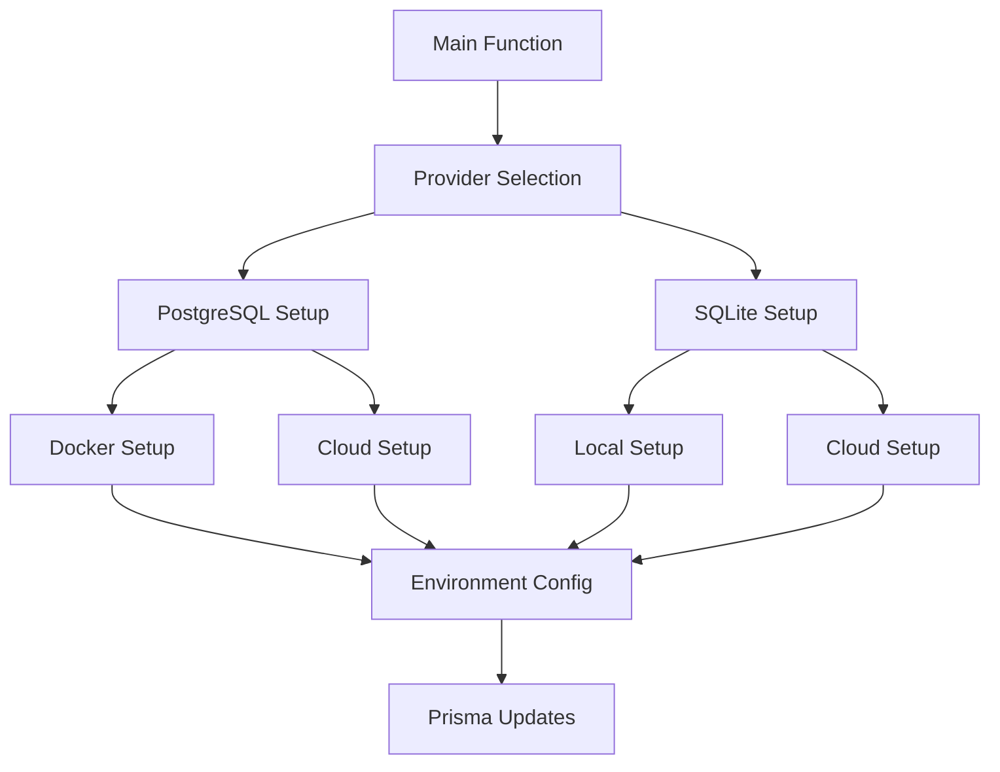

# Database Switching Script: Technical Documentation

This document explains the internal workings of the `switch-database.js` script, which manages database configuration for the application.

## Architecture Overview

The script is built with a modular architecture:



## Core Components

### 1. Docker Management

```typescript
async function checkDocker(): Promise<boolean>
```
Verifies Docker installation and daemon status using system commands.

```typescript
async function isPortInUse(port: string): Promise<boolean>
```
Checks port availability using `lsof` command.

```typescript
async function checkContainer(containerName: string): Promise<boolean>
```
Inspects existing Docker containers.

### 2. Credential Management

```typescript
interface DockerCredentials {
  user: string;
  password: string;
  database: string;
  port: string;
}

const DEFAULT_DOCKER_CONFIG: DockerCredentials
```

Handles database credentials with secure defaults.

### 3. Environment Management

The script manages two environment files:
- `.env`: Primary configuration
- `.env.local`: Local overrides (optional)

## Process Flow

1. **Initialization**
   ```javascript
   async function main() {
     // Provider validation
     // Setup selection
     // Environment configuration
     // Prisma updates
   }
   ```

2. **PostgreSQL Setup Flow**
   ```javascript
   async function setupPostgres() {
     // Docker checks
     // Credential collection
     // Container setup
     // Health verification
   }
   ```

3. **SQLite Setup Flow**
   ```javascript
   async function setupSqlite() {
     // Database type selection
     // File management
     // URL configuration
   }
   ```

## Key Features Implementation

### 1. Docker Health Checks

```yaml
healthcheck:
  test: ["CMD-SHELL", "pg_isready"]
  interval: 5s
  timeout: 5s
  retries: 5
```

Ensures database availability before proceeding.

### 2. Environment File Management

```javascript
const envContent = `DATABASE_URL=${databaseUrl}`;
fs.writeFileSync(path.join(rootDir, '.env'), envContent);
```

Maintains consistent environment configuration.

### 3. Prisma Schema Updates

```javascript
const datasourceRegex = /datasource db {[\s\S]*?}/;
const newDatasource = `datasource db {
  provider = "${provider}"
  url      = env("DATABASE_URL")
}`;
```

Dynamically updates Prisma configuration.

## Error Handling

The script implements comprehensive error handling:

1. **Operational Errors**
   ```javascript
   try {
     // Operation
   } catch (error) {
     console.error('\n❌ Error:', error.message);
     // Recovery steps
   }
   ```

2. **Validation Errors**
   - Provider validation
   - Credential validation
   - Port availability

3. **Resource Management**
   - File cleanup
   - Container management
   - Port release

## Security Considerations

1. **Credential Management**
   - No hardcoded secrets
   - Environment file protection
   - Secure credential prompts

2. **Docker Security**
   - Volume persistence
   - Port exposure control
   - Container isolation

3. **File System Security**
   - Proper file permissions
   - Secure file operations
   - Path validation

## Performance Optimizations

1. **Docker Operations**
   - Efficient health checks
   - Optimized container setup
   - Resource cleanup

2. **File Operations**
   - Minimal file writes
   - Efficient regex operations
   - Proper file handles

3. **Process Management**
   - Async operations
   - Resource cleanup
   - Memory management

## Extension Points

The script can be extended in several ways:

1. **New Database Providers**
   ```javascript
   // Add to validProviders array
   const validProviders = ['postgresql', 'sqlite', 'newdb'];
   ```

2. **Custom Setup Options**
   ```javascript
   async function setupCustomDB() {
     // Implementation
   }
   ```

3. **Additional Environment Management**
   ```javascript
   function updateCustomEnv() {
     // Implementation
   }
   ```

## Testing Guidelines

1. **Unit Tests**
   - Docker operations
   - File operations
   - Credential management

2. **Integration Tests**
   - Database connectivity
   - Environment configuration
   - Prisma integration

3. **End-to-End Tests**
   - Complete setup flow
   - Error scenarios
   - Recovery procedures

## Maintenance

Regular maintenance tasks:

1. **Dependencies**
   - Update Docker images
   - Update Prisma versions
   - Check system requirements

2. **Configuration**
   - Review default settings
   - Update cloud providers
   - Verify security settings

3. **Documentation**
   - Update technical docs
   - Maintain troubleshooting guide
   - Update security notes 